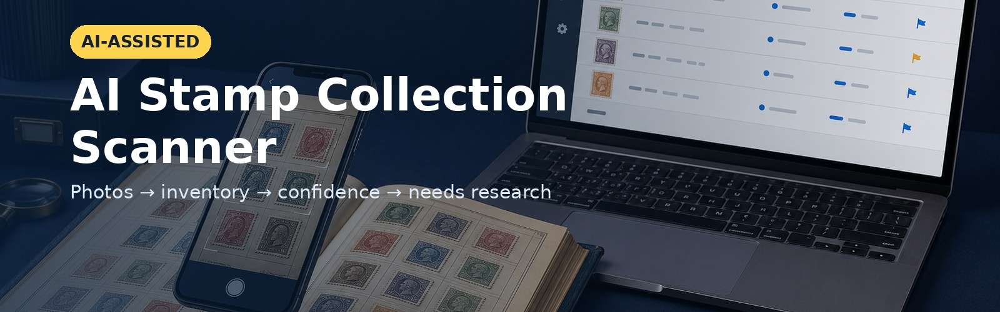

# AI Stamp Collection Scanner

**AI-Assisted Stamp Inventory**

Turn your stamp collection into a clear digital inventory. Upload collection photos, create structured and photo-linked records, keep track of every item and organise stamps that may deserve further research. The Browser Beta runs locally in your browser, and you remain in control of every detail.

## What it does

- Runs as a private Browser Beta at [AI Stamp Collection Scanner](https://vid567.github.io/ai-stamp-collection-scanner/beta/).
- Accepts one or more photos and creates an editable, photo-linked inventory workflow.
- Keeps photos and inventory details local to the browser.
- Exports the reviewed inventory to Excel or CSV.
- Marks unknown details for review instead of presenting uncertain information as fact.

The Browser Beta does not determine rarity, value, authenticity or an exact catalogue identity. It supports collector judgement; it does not replace it.

## Browser Beta v1.0 scope

- Browser-only; no Python, terminal or installation required.
- No embedded AI key and no external AI analysis in this Beta.
- Lightweight Excel and CSV exports.
- No photographs or thumbnails embedded in spreadsheets.
- Photo traceability through Record ID, Photo Number, Original Filename and Image Reference.

## Start

[Open the Browser Beta](https://vid567.github.io/ai-stamp-collection-scanner/beta/) or read the [Quick Start](beta/docs/quick-start-beta.html) and [User Guide](beta/docs/user-guide-beta.html).

## Website

The repository is ready for GitHub Pages. Publish from the `main` branch and repository root.

The public Browser Beta is served from `/beta/`. Its export remains intentionally lightweight and uses text-based photo traceability rather than embedded images.

## Product language

Use: **AI-assisted**, **suggested identification**, **confidence level**, **needs research**, **potentially interesting**.

Do not claim guaranteed identification, rarity, valuation or selling price.

## Content Creator

Use the [AI Stamp Scanner Content Creator](https://vid567.github.io/ai-stamp-collection-scanner/content-creator.html) to plan, copy and track the 25 prepared Threads posts. Planning data stays in the browser; the tool does not automatically publish to Threads.

## Licence

The downloadable toolkit is licensed for personal use. See `LICENSE.txt` inside the release package.
