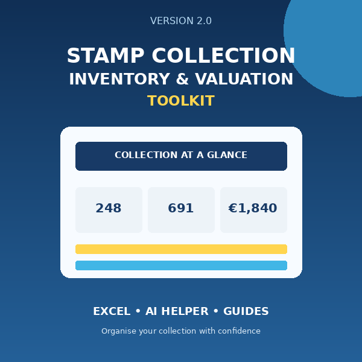

# AI Stamp Collection Scanner

**AI-Assisted Inventory & Research Toolkit**

Turn photos of a stamp collection into a structured inventory and identify which items may need further research.

## What it does

- Uses a photo-first workflow for album and stockbook pages.
- Produces structured, paste-ready Inventory rows with an AI helper prompt.
- Records suggested identification and confidence level.
- Reconciles visible photo counts against captured quantities.
- Flags classics, overprints, uncertain IDs and physical checks for research.
- Calculates collection totals from estimated per-stamp values.

AI output is a starting point—not authentication, guaranteed identification or professional valuation.

## Download

[Download the complete Version 2.0 toolkit](downloads/AI-Stamp-Collection-Scanner-v2.0.zip)

## Included

- Reusable Excel inventory workbook
- Filled sample workbook
- AI Photo-ID prompt
- User Guide
- Country and inscription cheat-sheet
- Quick Start Card
- Google Sheets notes

## Website

The repository is ready for GitHub Pages. Publish from the `main` branch and repository root.

## Product language

Use: **AI-assisted**, **suggested identification**, **confidence level**, **needs research**, **potentially interesting**.

Do not claim guaranteed identification, rarity, valuation or selling price.

## Licence

The downloadable toolkit is licensed for personal use. See `LICENSE.txt` inside the release package.

